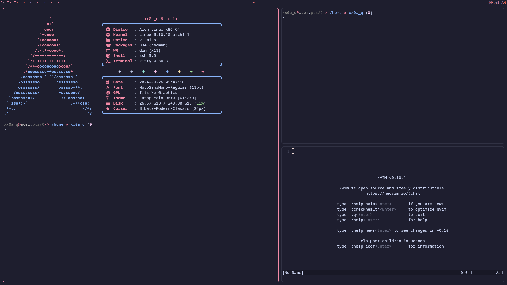

<div align="center">
<h1>My DWL Rice [WIP]</h1>

<!--  -->

<h1>Installation</h1>

The installation script is designed for a minimal <a href="https://wiki.archlinux.org/title/Arch_Linux" target="_blank">Arch Linux</a> install, but may work on some <a href="https://wiki.archlinux.org/title/Arch-based_distributions" target="_blank">Arch-based distros</a>.

</div>

> [!IMPORTANT]
> This rice relies on having a permament existing `dwm/` directory. **Don't remove the directory after setup.**

#### To install, execute the following commands:
> [!CAUTION]
> This might overwrite your existing dotfiles. Make sure to back everything up.

```bash
git clone -b dwl https://github.com/adamperkowski/dwm.git
cd dwm
./install.sh
```

#### To update, execute the following commands:

```bash
cd $DWM_DIR
./update.sh
```

You might need to re-run `./install.sh` after an update.

<div align="center">
<h1>Keybind List</h1>

|Keybind|Description|
|---|---|
|`SUPER + RETURN`|Spawns `kitty` (terminal)|
|`SUPER + SHIFT + RETURN`|Spawns `rofi` (application launcher)|
|`PRNTSCR`|Spawns `flameshot gui` (screenshot utility)|
|`SUPER + DOWN` or `RIGHT`|Moves focus to previous window|
|`SUPER + UP` or `LEFT`|Moves focus to next window|
|`SUPER + SHIFT + UP` or `RIGHT`|Resizes selected window up or right|
|`SUPER + SHIFT + DOWN` or `LEFT`|Resizes selected window down or left|
|`SUPER + LMB`|Drags selected window|
|`SUPER + RMB`|Resizes selected window|
|`SUPER + I`|Increases master window|
|`SUPER + D`|Decreases master window|
|`SUPER + TAB`|Enters focus mode|
|`SUPER + SHIFT + TAB`|Exits focus mode|
|`SUPER + SHIFT + C`|Kills selected window|
|`SUPER + SPACE`|Toggles floating mode|
|`SUPER + F`|Toggles fullscreen mode|
|`SUPER + ,`|Moves focus to previous monitor|
|`SUPER + .`|Moves focus to next monitor|
|`SUPER + SHIFT + ,`|Moves selected window to previous monitor|
|`SUPER + SHIFT + .`|Moves selected window to next monitor|
|`SUPER + 1`-`9`|Moves focus to a tag `1`-`9`|
|`SUPER + 0`|Shows all windows|
|`SUPER + SHIFT + Q`|Kills dwl|
|`SUPER + SHIFT + W`|Restarts dwl|

</div>
